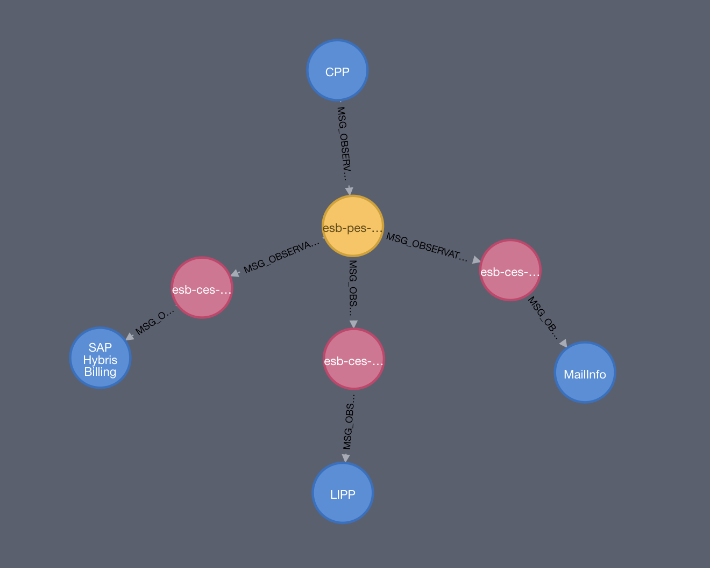

# cypher-serviceregistry

Basic examples of loading data into Neo4j.



## How to
Run scripts in following order:
1. src/Create Nodes.cypher
2. src/Create Edges.cypher

## Example statements

### Count stuff

#### Count nodes
```
MATCH (`n: *`) RETURN count(*)+" nodes" as total;
```
#### Count all edges
```
MATCH (n)-[r]->() RETURN COUNT(r)
```
#### Count outgoing edges from a specific node
```
MATCH (n)-[r]->() WHERE n.name = 'esb-pes-cpp-observationbulkmail' RETURN COUNT(r)
```
### Aggregate stuff

#### Aggregate nodes per label
```
MATCH (n) RETURN DISTINCT count(labels(n)), labels(n);
```

#### Aggregate per edge type
```
MATCH (a)-[r]->(b)
RETURN distinct(type(r))
```

### Common

#### Delete all
```
MATCH (n) DETACH DELETE n
```
#### Delete edge of a specific ID
```
MATCH ()-[r]-() WHERE id(r)=2 DELETE r
```
#### Delete nodes of a specific ID
```
MATCH (n) where id(n) = 21 DETACH DELETE n
```
#### Rename a edge
```
match (n1)-[old:`SND_RCV`]->(n2)
create (n1)-[new:SND_RCV_PA]->(n2)
delete old
```
#### Add a Property
```
MATCH (n:Adapter)
WHERE n.name= "SBSAdapter"
SET n.doclink = 'http://www.postnl.nl'
RETURN n
```
